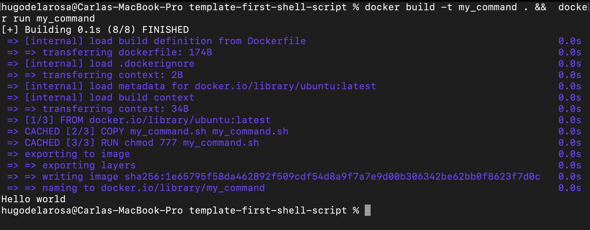
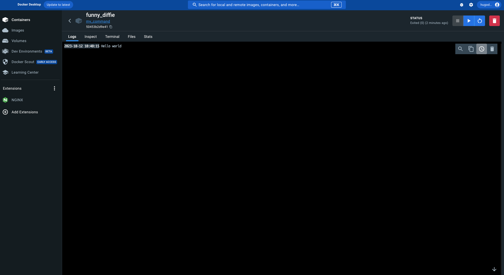
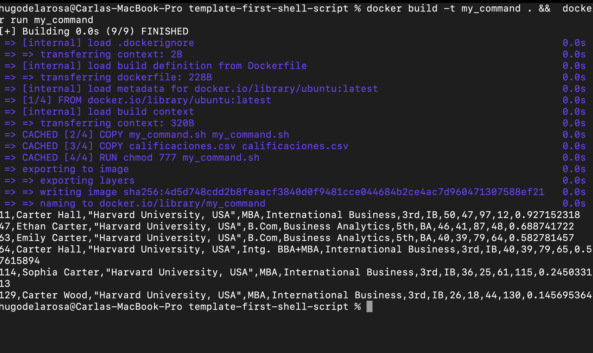

# Primer shell script

Dentro de este repositorio encontraras los siguientes archivos:

- `my_command.sh` que sera donde realizaras tu ejercicio 
- `Dockerfile` por si tienen curiosidad es el responsaable de correr el script que vas a realizar
- ``

## Para ejecutar tu script
Asegurate de las siguientes cosas 

- Docker desktop esta corriendo sin problema 
- Los comandos que veras a lo largo de esta guia deberas de ejecutarlos en `Powershell` o `gitbash`
- Corre el siguiente comando: `docker build -t my_command . &&  docker run my_command`
  - En caso de que el comando de arriba no te funcione deberas separarlos de la siguiente manera:
    - `docker build -t my_command .`
    - `docker run my_command`

El resultado de correr el comando debera ser similar a lo siguiente:

Tambien lo puedes ver en docker desktop y se vera de esta manera

## Tarea
De acuerdo a lo que vimos en clase debes de crear un script que nos permita obtener la fila donde
se encuentre el nombre de la persona que se reciba como parametro.

En el Docker file ya esta listo para recibir el parametro "Carter", la salida de este deberia ser 
similar a lo que se muestra abajo

